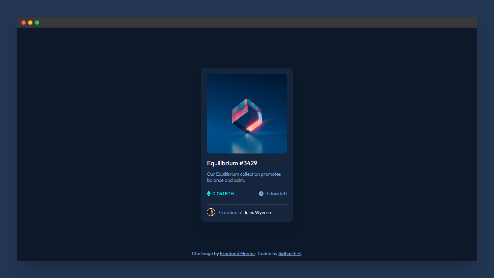

# Frontend Mentor - Huddle landing page with single introductory section solution

This is a solution to the [NFT preview card component challenge on Frontend Mentor](https://www.frontendmentor.io/challenges/nft-preview-card-component-SbdUL_w0U). Frontend Mentor challenges help you improve your coding skills by building realistic projects. 

## Table of contents

- [Overview](#overview)
  - [The challenge](#the-challenge)
  - [Screenshot](#screenshot)
  - [Links](#links)
- [Built with](#built-with)
- [Author](#author)

## Overview

### The challenge

Users should be able to:

- View the optimal layout depending on their device's screen size
- See hover states for interactive elements

### Screenshot

### Links

- Solution URL: [Frontend Mentor](https://your-solution-url.com)
- Live Site URL: [Netlify](https://nft-card-component-sh.netlify.app/)

## Built with

- Semantic HTML5 markup
- CSS custom properties
- Flexbox

## Author

- Website - [Sidharth H.](https://www.sidharthh.in)
- Frontend Mentor - [@tenocijam](https://www.frontendmentor.io/profile/tenocijam)
- Twitter - [@tenocijam](https://www.twitter.com/tenocijam)
- Instagram - [@tenocijam](https://www.instagram.com/tenocijam)
- GitHub - [@tenocijam](https://www.github.com/tenocijam)